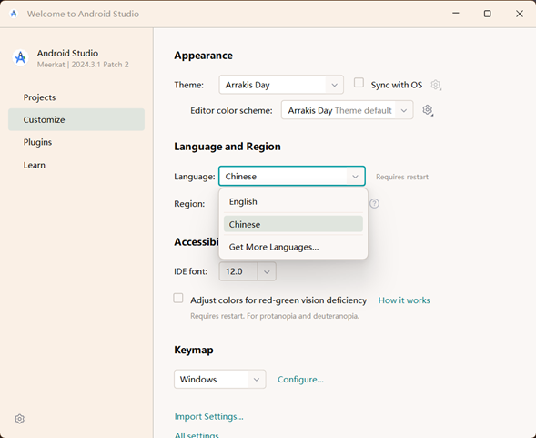
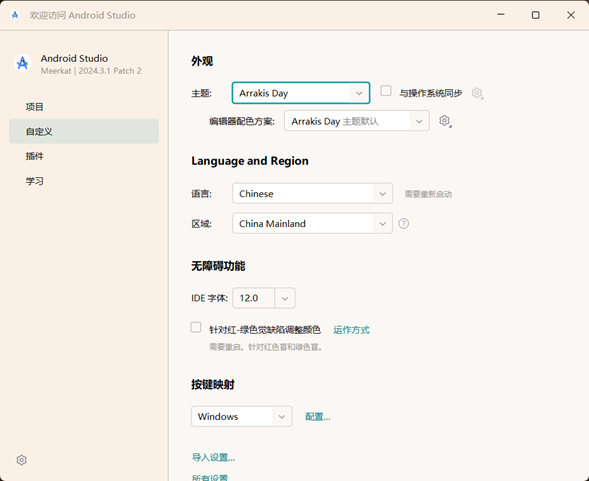

# 最新版Android Studio汉化包

基于zh.242.152汉化包的版本适配修改，适用于最新版本Android Studio汉化

------

## 前言

#### Keywords:Android Studio最新汉化包，兼容beta版本。

#### 我们都知道，Android Studio的汉化可以直接使用IntelliJ IDEA的汉化包，但是由于Android Studio更新了版本，最新版本243*，但是IntelliJ IDEA汉化包最新版是242*，所以一旦你更新了最新版本，常规途径下只要汉化包不更新你将无法使用汉化，但实际上我们常用的菜单项通常不会变化，没必要一直更新汉化包那么麻烦，由此，我修改了版本适配供大家直接使用，版本适配修改为249*，理论上不用怕以后的更新了。

## 使用

#### 本仓库内提供了zh.249.zip这个压缩包，经常使用IntelliJ IDEA的汉化包来汉化Android Studio的应该都清楚如何使用，但是由于我只修改了版本匹配，所以还存在一些小问题，需要手动操作一下。

#### 需要在这里手动将语言改为Chinese，重启后就OK了，如下图

## Star History

<a href="https://www.star-history.com/?repos=firework-a/AS-Chinese-Simplified-Language-Pack&type=date&legend=top-left">
 <picture>
   <source media="(prefers-color-scheme: dark)" srcset="https://api.star-history.com/image?repos=firework-a/AS-Chinese-Simplified-Language-Pack&type=date&theme=dark&legend=top-left" />
   <source media="(prefers-color-scheme: light)" srcset="https://api.star-history.com/image?repos=firework-a/AS-Chinese-Simplified-Language-Pack&type=date&legend=top-left" />
   
 </picture>
</a>

## 最后，如果对各位有帮助，劳烦各位点个star，感谢~
